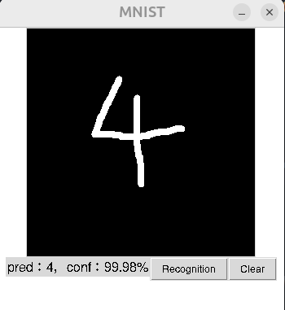
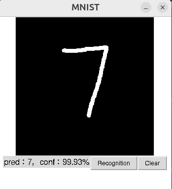

# MNIST Digit Recognize
用PyTorch來做MNIST辨識，利用Tkinter的Canvas來做手寫數字的辨識，順便了解DL的應用
## Demo



```
model.py               # CNN模型
train.py               # 訓練模型檔案
window.py              # Tkinter的視窗
mnist_cnn.pth          # 訓練好的weights
```
## How to use it
```bash
pip install -r requirements.txt
```
## Train the model
Run:
```bash
python train.py
```
## Run the GUI
Run:

```bash
python window.py
```